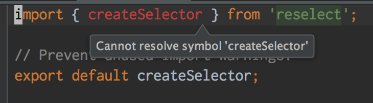
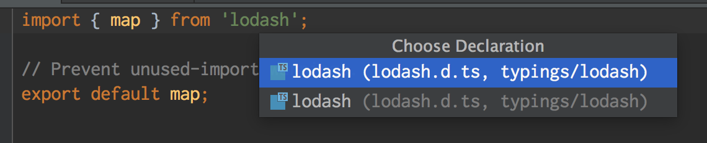

# webstorm-typescript-sadness

Webstorm version `EAP 163.4396.14`. TypeScript settings:

- Node 6.5.0 (via `homebrew`)
- using packaged TypeScript version (1.8.10)
- "Enable TypeScript Compiler" and "Use TypeScript Service" both disabled

## Issue 1

Webstorm can't find types packaged with node modules when you've ignored `node_modules`. Ignoring `node_modules` is a must, since I use [Lerna](https://github.com/lerna/lerna) and I'm not going to individually "mark directory as excluded" on every of the 100+ `node_modules` instances I have.

### Reproduction

1. Clone this repo.
2. Start a new project in Webstorm.
3. Go to `Preferences > Directories > Add Content Root` and add `nested-project`.
4. Go to `Editor > File Types > Ignore files and folders` and add an entry for `node_modules`.
5. Open `reselect.ts` and see that it complains about imports.

## Issue 2

Webstorm finds too many copies of typings if you have multiple ones available that match, even if they are outside the Typescript project (as defined by `tsconfig.json`).

### Reproduction

1. Clone this repo twice with different names.
2. Start a new project in Webstorm.
3. Go to `Preferences > Directories > Add Content Root` and add both repos.
4. Open `lodash.ts` and try to go-to-declaration on the `import` statement and see that it gives you both copies of `lodash.d.ts` despite being in totally different directories (and across the `tsconfig` boundary).
